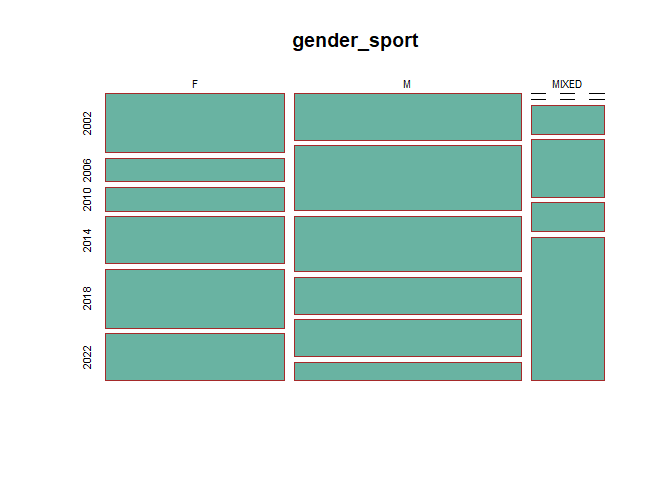
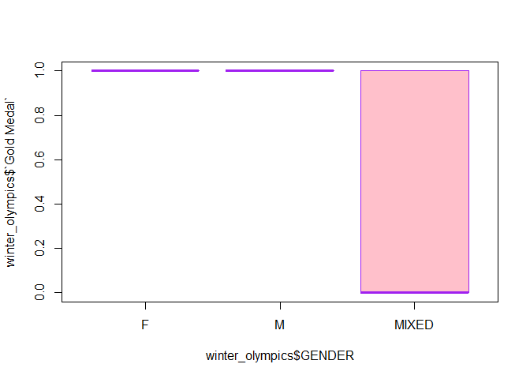
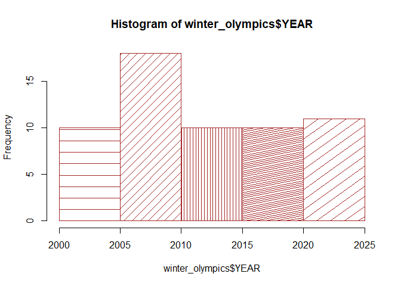

# Intro

## What

This project is about US winter Olympic Gold medalists for the past 20
years. ## Why The reason I chose this topic is because winter Olympic
just finished this year in Beijing, China. I did see some improvements
of Chinese athletes this year, it seems that they won some gold medals
that were big challenges for them in the past. I am curious to know how
has Team US been doing, for example, some of the winter games Team US
have been quite good at 10 years ago, are they still leaders? ## How I
created an excel file which contains data of US Winter Olympics Gold
Medalists from year 2002 to year 2022.I found these data from Wikipedia.
# Body

My excel file has the following columns:

    library(readxl)

    ## Warning: package 'readxl' was built under R version 4.1.3

    winter_olympics <- read_excel("C:/Users/vicky/Downloads/Ying-s-631-final-p/winter olympics.xlsx")

    names(winter_olympics)

    ## [1] "YEAR"       "NAME"       "SPORT"      "WOMEN"      "MEN"        "GENDER"     "Gold Medal"

1.  I would like to see how many gold medals did Team US won for the
    past 20 years?

<!-- -->

    table(winter_olympics$`Gold Medal`)

    ## 
    ##  0  1 
    ##  5 54

There are total of 54 gold medals Team Us won in the past 20 years.

1.  I would like to compare women vs. men who won more medals overall
    and compare the ratios.

<!-- -->

    table(winter_olympics$WOMEN)

    ## 
    ##  0  1 
    ## 37 22

    table(winter_olympics$MEN)

    ## 
    ##  0  1 
    ## 31 28

    table(winter_olympics$WOMEN)/table(winter_olympics$`Gold Medal`)

    ## 
    ##         0         1 
    ## 7.4000000 0.4074074

    table(winter_olympics$MEN)/table(winter_olympics$`Gold Medal`)

    ## 
    ##         0         1 
    ## 6.2000000 0.5185185

As we can see the above calculations, overall, men won more gold medals
than women for the past 20 years in winter Olympics.

1.  I want to find out which year did TEAM US won the most Gold Medals
    in Winter Olympics?

<!-- -->

    aggregate(`Gold Medal` ~ YEAR, data=winter_olympics, FUN=sum)

    ##   YEAR Gold Medal
    ## 1 2002         10
    ## 2 2006          9
    ## 3 2010          9
    ## 4 2014          9
    ## 5 2018          9
    ## 6 2022          8

As we can tell that Team US won the most gold medals in year 2002 winter
olympics with a total of 10. Year 2022 Team US won least gold medals,
with a total of 8.

1.  below are some bar plots I use to further represent the portion of
    women vs. men in winter olympics.

<!-- -->

    barplot(table(winter_olympics$MEN))

    barplot(table(winter_olympics$WOMEN))

    gender_sport <- table(winter_olympics$GENDER, winter_olympics$YEAR)
    mosaicplot(gender_sport)

 5. below
are the box plots of showing gender portion of different Olympic games

    boxplot(winter_olympics$YEAR ~ winter_olympics$GENDER)

    boxplot(winter_olympics$`Gold Medal` ~ winter_olympics$GENDER)

    hist(winter_olympics$`Gold Medal`)

1.  I would like to see which sports Team US won the most medals,I will
    use tidyverse to demonstrate this.

<!-- -->

    library(tidyverse)

    ## Warning: package 'tidyverse' was built under R version 4.1.3

    ## -- Attaching packages ------------------------------------------------------------------------------- tidyverse 1.3.1 --

    ## v ggplot2 3.3.6     v purrr   0.3.4
    ## v tibble  3.1.7     v dplyr   1.0.9
    ## v tidyr   1.2.0     v stringr 1.4.0
    ## v readr   2.1.2     v forcats 0.5.1

    ## Warning: package 'ggplot2' was built under R version 4.1.3

    ## Warning: package 'tibble' was built under R version 4.1.3

    ## Warning: package 'tidyr' was built under R version 4.1.3

    ## Warning: package 'readr' was built under R version 4.1.3

    ## Warning: package 'purrr' was built under R version 4.1.3

    ## Warning: package 'dplyr' was built under R version 4.1.3

    ## Warning: package 'forcats' was built under R version 4.1.3

    ## -- Conflicts ---------------------------------------------------------------------------------- tidyverse_conflicts() --
    ## x dplyr::filter() masks stats::filter()
    ## x dplyr::lag()    masks stats::lag()

    winter_olympics%>% group_by(SPORT)%>% summarise(n=n())

    ## # A tibble: 13 x 2
    ##    SPORT                         n
    ##    <chr>                     <int>
    ##  1 Alpine skiing                 7
    ##  2 Bobsled                       1
    ##  3 Bobsleigh                     2
    ##  4 Cross-country skiing          2
    ##  5 Curling                       1
    ##  6 Figure skating                5
    ##  7 Freestyle skiing              9
    ##  8 Ice hockey                    1
    ##  9 Nordic combined               1
    ## 10 Short track speed skating     2
    ## 11 Skeleton                      2
    ## 12 Snowboarding                 18
    ## 13 Speed skating                 8

As we can see from the above, Team US won the most gold medals in
Snowboarding with 18 gold medals in total.

\`\`\`

# Topics From Class

## Topic 1:

R Markdown-I really like how many functions R Markdown has offered. We
can easily convert the files to word, pdf and html by using Knit. We can
also insert R commands in between our texts and run it by single
sentence or run the whole commands.

## Topic 2:

Github-we can push R Markdown files on Github, share a link, and others
can read our files.

## Topic 3:

Probability-I used probability calculation for my project to show women
and men’s ratio in winter olympic games.

## Topic 4:

Tidyservice-I used tidyservice to show which sport Team USA won the most
gold medals in winter olympics, because the column sport are not
numbers, they are strings, I couldn’t get it to work in the basic R,
tidyservice has the functions to group strings.

## Topic 5:

table command-I used this command to show a summary of how many men or
women won the onlympic gold medals.

# Conclusion

This final project helps me review some of the knowleges or commands we
learned in class and assignments, such as R markdown, Tidyservice,
probability, barplots, mosiacplot, etc. I think this is a good way to
put what we learned into practices.
